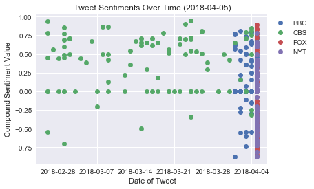
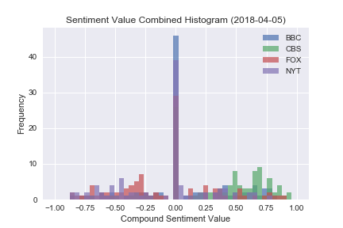

# News Mood

Some data science practice pinging Twitter's API and doing sentiment analysis.

1. Scatter Plot of the last 100 tweets sent out by BBC, CBS, CNN, Fox, and NYT, ranging from -1.0 to 1.0 based on sentiment.  0 is neutral, -1 is negative, and 1 is positive.  Each plot point will be the *compound* sentiment of the tweet.  Points will be sorted by timestamp.
2. Bar Plot visualizing the overall sentiments of the last 100 tweets from each organization.  Again, we will aggregate the *compound sentiments*.

We will need to use `tweepy, pandas, matplotlib, seaborn, textblob, and VADER`.

The final notebook must:

 - Pull the last 100 tweets from each outlet.
 - Perform a sentiment analysis with compound, positive, neutral, and negative scoring for each tweet.
 - Pull source account, text, date, compound, positive, neutral, and negative scores into a DataFrame.
 - Export the data into a CSV.
 - Save PNG's of each plot.
 - Observe trends.
 - Label plot axes and titles.  Plot titles must include date.

 <hr>

```python
from datetime import date

from matplotlib import pyplot as plt
import numpy as np
import pandas as pd
import seaborn
import tweepy
from vaderSentiment.vaderSentiment import SentimentIntensityAnalyzer

from secrets import CONSUMER_KEY, CONSUMER_SECRET, ACCESS_TOKEN, ACCESS_SECRET

seaborn.set()
```


```python
NEWS_ORGS = {
    "BBC": "@BBC",
    "CBS": "@CBS",
    "FOX": "@FoxNews",
    "NYT": "@nytimes",
}
```


```python
def get_api(consumer_key, consumer_secret, access_token, access_secret):
    """Returns a handle on the Twitter API, provided by Tweepy"""
    auth = tweepy.OAuthHandler(consumer_key, consumer_secret)
    auth.set_access_token(access_token, access_secret)

    return tweepy.API(auth)
```


```python
api = get_api(CONSUMER_KEY, CONSUMER_SECRET, ACCESS_TOKEN, ACCESS_SECRET)
```


```python
def get_recent_tweets(api, orgs, count=100):
    """Downloads the 'count' most recent tweets from each org.

    api: twitter API handle, provided by Tweepy
    orgs: dictionary of {org name: twitter handle}
    count: number of tweets per org to get
    Returns a dictionary of {org name: [statuses...]}
    """
    results = {}
    for org, handle in orgs.items():
        most_recent_statuses = api.user_timeline(handle, count=100)
        results[org] = most_recent_statuses
    return results
```


```python
recents = get_recent_tweets(api, NEWS_ORGS)
```


```python
dir(recents["BBC"][0])
```


    ['__class__',
     '__delattr__',
     '__dict__',
     '__dir__',
     '__doc__',
     '__eq__',
     '__format__',
     '__ge__',
     '__getattribute__',
     '__getstate__',
     '__gt__',
     '__hash__',
     '__init__',
     '__init_subclass__',
     '__le__',
     '__lt__',
     '__module__',
     '__ne__',
     '__new__',
     '__reduce__',
     '__reduce_ex__',
     '__repr__',
     '__setattr__',
     '__sizeof__',
     '__str__',
     '__subclasshook__',
     '__weakref__',
     '_api',
     '_json',
     'author',
     'contributors',
     'coordinates',
     'created_at',
     'destroy',
     'entities',
     'favorite',
     'favorite_count',
     'favorited',
     'geo',
     'id',
     'id_str',
     'in_reply_to_screen_name',
     'in_reply_to_status_id',
     'in_reply_to_status_id_str',
     'in_reply_to_user_id',
     'in_reply_to_user_id_str',
     'is_quote_status',
     'lang',
     'parse',
     'parse_list',
     'place',
     'possibly_sensitive',
     'retweet',
     'retweet_count',
     'retweeted',
     'retweets',
     'source',
     'source_url',
     'text',
     'truncated',
     'user']


```python
this_tweet = recents["BBC"][0]
print(type(this_tweet.created_at))
this_tweet.created_at.date()
```

    <class 'datetime.datetime'>
    


    datetime.date(2018, 4, 5)


```python
def analyze_tweets(tweets):
    """Analyze polarity sentiments of tweets.
    tweets: a list of Tweepy Status objects.
    Returns: a list of VADER polarity scores of the form
             {'neg': 0.0, 'neu': 0.254, 'pos': 0.746, 'compound': 0.8316}
    """
    texts = [tweet.text for tweet in tweets]
    analyzer = SentimentIntensityAnalyzer()
    return [analyzer.polarity_scores(text) for text in texts]
```


```python
org_sentiments = {org: analyze_tweets(tweets) for (org, tweets) in recents.items()}
org_sentiments["BBC"][:5]
```


    [{'compound': -0.6908, 'neg': 0.217, 'neu': 0.783, 'pos': 0.0},
     {'compound': 0.7096, 'neg': 0.0, 'neu': 0.629, 'pos': 0.371},
     {'compound': 0.0, 'neg': 0.0, 'neu': 1.0, 'pos': 0.0},
     {'compound': -0.765, 'neg': 0.32, 'neu': 0.68, 'pos': 0.0},
     {'compound': 0.0, 'neg': 0.0, 'neu': 1.0, 'pos': 0.0}]


```python
df_data = []
for org, tweets in recents.items():
    for ind, tweet in enumerate(tweets):
        df_data.append([
            tweet.created_at.date(),
            org,
            tweet.text,
            org_sentiments[org][ind]["neg"],
            org_sentiments[org][ind]["neu"],
            org_sentiments[org][ind]["pos"],
            org_sentiments[org][ind]["compound"],
        ])
tweet_data = pd.DataFrame(df_data)
tweet_data.columns = ["date", "organization", "text", "neg", "neu", "pos", "compound"]
tweet_data.head()
```


<table border="1" class="dataframe">
  <thead>
    <tr style="text-align: right;">
      <th></th>
      <th>date</th>
      <th>organization</th>
      <th>text</th>
      <th>neg</th>
      <th>neu</th>
      <th>pos</th>
      <th>compound</th>
    </tr>
  </thead>
  <tbody>
    <tr>
      <th>0</th>
      <td>2018-04-05</td>
      <td>BBC</td>
      <td>'There’s the England before Stephen, and there...</td>
      <td>0.217</td>
      <td>0.783</td>
      <td>0.000</td>
      <td>-0.6908</td>
    </tr>
    <tr>
      <th>1</th>
      <td>2018-04-05</td>
      <td>BBC</td>
      <td>🐆 Could building walkways in nature help save ...</td>
      <td>0.000</td>
      <td>0.629</td>
      <td>0.371</td>
      <td>0.7096</td>
    </tr>
    <tr>
      <th>2</th>
      <td>2018-04-05</td>
      <td>BBC</td>
      <td>😋😋 Pocket-friendly recipes for two.\n👉 https:/...</td>
      <td>0.000</td>
      <td>1.000</td>
      <td>0.000</td>
      <td>0.0000</td>
    </tr>
    <tr>
      <th>3</th>
      <td>2018-04-05</td>
      <td>BBC</td>
      <td>👀 From illegal ivory to taxidermy, take a peek...</td>
      <td>0.320</td>
      <td>0.680</td>
      <td>0.000</td>
      <td>-0.7650</td>
    </tr>
    <tr>
      <th>4</th>
      <td>2018-04-05</td>
      <td>BBC</td>
      <td>RT @bbccomedy: Smithy is an irl ray of #sunshi...</td>
      <td>0.000</td>
      <td>1.000</td>
      <td>0.000</td>
      <td>0.0000</td>
    </tr>
  </tbody>
</table>


```python
print(tweet_data.shape)
```

    (400, 7)
    


```python
tweet_data[tweet_data["organization"]=="CBS"]["date"].min()
```


    datetime.date(2018, 2, 26)


```python
for org in NEWS_ORGS.keys():
    subset = tweet_data[tweet_data["organization"]==org]
    plt.plot(subset["date"], subset["compound"], 'o', label=org)
plt.xlabel("Date of Tweet")
plt.ylabel("Compound Sentiment Value")
plt.title(f"Tweet Sentiments Over Time ({date.today()})")
plt.legend(bbox_to_anchor=(1, 1))
plt.savefig(f"{date.today()}-timeseries.png", bbox_inches="tight")
plt.show()
```





```python
tweet_data.to_csv("4-5-18-1520_tweet_data.csv")
```


```python
bins = np.linspace(-1.0, 1.0, 50)
for org in NEWS_ORGS.keys():
    subset = tweet_data[tweet_data["organization"]==org]
    plt.hist(subset["compound"], bins, alpha=0.7, label=org)
plt.legend()
plt.xlabel("Compound Sentiment Value")
plt.ylabel("Frequency")
plt.title(f"Sentiment Value Combined Histogram ({date.today()})")
plt.savefig(f"{date.today()}-histogram.png")
plt.show()
```





```python
tweet_data[tweet_data["organization"]=="BBC"].describe()
```


<table border="1" class="dataframe">
  <thead>
    <tr style="text-align: right;">
      <th></th>
      <th>neg</th>
      <th>neu</th>
      <th>pos</th>
      <th>compound</th>
    </tr>
  </thead>
  <tbody>
    <tr>
      <th>count</th>
      <td>100.000000</td>
      <td>100.000000</td>
      <td>100.000000</td>
      <td>100.000000</td>
    </tr>
    <tr>
      <th>mean</th>
      <td>0.036820</td>
      <td>0.888800</td>
      <td>0.074380</td>
      <td>0.092903</td>
    </tr>
    <tr>
      <th>std</th>
      <td>0.081671</td>
      <td>0.122069</td>
      <td>0.108243</td>
      <td>0.372813</td>
    </tr>
    <tr>
      <th>min</th>
      <td>0.000000</td>
      <td>0.576000</td>
      <td>0.000000</td>
      <td>-0.875000</td>
    </tr>
    <tr>
      <th>25%</th>
      <td>0.000000</td>
      <td>0.789000</td>
      <td>0.000000</td>
      <td>0.000000</td>
    </tr>
    <tr>
      <th>50%</th>
      <td>0.000000</td>
      <td>0.905000</td>
      <td>0.000000</td>
      <td>0.000000</td>
    </tr>
    <tr>
      <th>75%</th>
      <td>0.000000</td>
      <td>1.000000</td>
      <td>0.138750</td>
      <td>0.361200</td>
    </tr>
    <tr>
      <th>max</th>
      <td>0.333000</td>
      <td>1.000000</td>
      <td>0.371000</td>
      <td>0.812200</td>
    </tr>
  </tbody>
</table>


```python
tweet_data[tweet_data["organization"]=="CBS"].describe()
```


<table border="1" class="dataframe">
  <thead>
    <tr style="text-align: right;">
      <th></th>
      <th>neg</th>
      <th>neu</th>
      <th>pos</th>
      <th>compound</th>
    </tr>
  </thead>
  <tbody>
    <tr>
      <th>count</th>
      <td>100.000000</td>
      <td>100.000000</td>
      <td>100.000000</td>
      <td>100.000000</td>
    </tr>
    <tr>
      <th>mean</th>
      <td>0.020860</td>
      <td>0.827120</td>
      <td>0.152000</td>
      <td>0.362195</td>
    </tr>
    <tr>
      <th>std</th>
      <td>0.052303</td>
      <td>0.134438</td>
      <td>0.131051</td>
      <td>0.380300</td>
    </tr>
    <tr>
      <th>min</th>
      <td>0.000000</td>
      <td>0.462000</td>
      <td>0.000000</td>
      <td>-0.698100</td>
    </tr>
    <tr>
      <th>25%</th>
      <td>0.000000</td>
      <td>0.747250</td>
      <td>0.000000</td>
      <td>0.000000</td>
    </tr>
    <tr>
      <th>50%</th>
      <td>0.000000</td>
      <td>0.821500</td>
      <td>0.150500</td>
      <td>0.490550</td>
    </tr>
    <tr>
      <th>75%</th>
      <td>0.000000</td>
      <td>1.000000</td>
      <td>0.238000</td>
      <td>0.675575</td>
    </tr>
    <tr>
      <th>max</th>
      <td>0.230000</td>
      <td>1.000000</td>
      <td>0.538000</td>
      <td>0.945100</td>
    </tr>
  </tbody>
</table>


```python
tweet_data[tweet_data["organization"]=="FOX"].describe()
```


<table border="1" class="dataframe">
  <thead>
    <tr style="text-align: right;">
      <th></th>
      <th>neg</th>
      <th>neu</th>
      <th>pos</th>
      <th>compound</th>
    </tr>
  </thead>
  <tbody>
    <tr>
      <th>count</th>
      <td>100.000000</td>
      <td>100.000000</td>
      <td>100.000000</td>
      <td>100.000000</td>
    </tr>
    <tr>
      <th>mean</th>
      <td>0.097390</td>
      <td>0.842250</td>
      <td>0.060360</td>
      <td>-0.078951</td>
    </tr>
    <tr>
      <th>std</th>
      <td>0.119867</td>
      <td>0.131574</td>
      <td>0.105857</td>
      <td>0.412206</td>
    </tr>
    <tr>
      <th>min</th>
      <td>0.000000</td>
      <td>0.509000</td>
      <td>0.000000</td>
      <td>-0.865800</td>
    </tr>
    <tr>
      <th>25%</th>
      <td>0.000000</td>
      <td>0.737750</td>
      <td>0.000000</td>
      <td>-0.361200</td>
    </tr>
    <tr>
      <th>50%</th>
      <td>0.000000</td>
      <td>0.855500</td>
      <td>0.000000</td>
      <td>0.000000</td>
    </tr>
    <tr>
      <th>75%</th>
      <td>0.172750</td>
      <td>1.000000</td>
      <td>0.110250</td>
      <td>0.128000</td>
    </tr>
    <tr>
      <th>max</th>
      <td>0.416000</td>
      <td>1.000000</td>
      <td>0.465000</td>
      <td>0.888500</td>
    </tr>
  </tbody>
</table>


```python
tweet_data[tweet_data["organization"]=="NYT"].describe()
```


<table border="1" class="dataframe">
  <thead>
    <tr style="text-align: right;">
      <th></th>
      <th>neg</th>
      <th>neu</th>
      <th>pos</th>
      <th>compound</th>
    </tr>
  </thead>
  <tbody>
    <tr>
      <th>count</th>
      <td>100.000000</td>
      <td>100.000000</td>
      <td>100.000000</td>
      <td>100.000000</td>
    </tr>
    <tr>
      <th>mean</th>
      <td>0.075600</td>
      <td>0.878470</td>
      <td>0.045910</td>
      <td>-0.094217</td>
    </tr>
    <tr>
      <th>std</th>
      <td>0.107205</td>
      <td>0.132251</td>
      <td>0.080389</td>
      <td>0.371639</td>
    </tr>
    <tr>
      <th>min</th>
      <td>0.000000</td>
      <td>0.408000</td>
      <td>0.000000</td>
      <td>-0.872000</td>
    </tr>
    <tr>
      <th>25%</th>
      <td>0.000000</td>
      <td>0.799250</td>
      <td>0.000000</td>
      <td>-0.411525</td>
    </tr>
    <tr>
      <th>50%</th>
      <td>0.000000</td>
      <td>0.879500</td>
      <td>0.000000</td>
      <td>0.000000</td>
    </tr>
    <tr>
      <th>75%</th>
      <td>0.153000</td>
      <td>1.000000</td>
      <td>0.083750</td>
      <td>0.025800</td>
    </tr>
    <tr>
      <th>max</th>
      <td>0.515000</td>
      <td>1.000000</td>
      <td>0.418000</td>
      <td>0.778300</td>
    </tr>
  </tbody>
</table>


## Conclusions

It appears from the first figure that CBS tweets far less than the BBC, and they both tweet less than the NY Times and Fox News.  Both Fox News and the NY Times have all 100 most recent tweets appearing today, while CBS's 100th-most-recent tweet was over a month ago.

From the histogram, we can see that CBS, is generally more positive than the other news outlets.  There seems to be a spike around zero, especially for the BBC.  One might hope that that points to a lack of impassioned twitter rants on their part, but it could also be a difference in the language the VADER evaluates.

Both the NY Times and Fox News seem to be shifted towards the negative end of the spectrum (although the BBC actually has the overall "most negative" tweet).
